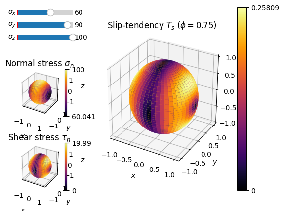

# [Slip-tendency analysis and fault reactivation](https://doi.org/10.1130/0091-7613(1996)024%3C0275:STAAFR%3E2.3.CO;2)

For most stress fields, the are two candidate planes for slip: the two planes intersecting in the direction of $\sigma_2$ and symmetric about $\sigma_1$ and $\sigma_3$. These are the planes with the maximal shear stress.

The slip tendency sliptendency is defined as $T_s = \tau_n/\sigma_n$ ($T_s=\mu$ when about to slip) and can be computed for any arbitrary surface.

Once the complete stress tensor is known, the normal stress $\sigma_n$ and the normal shear $\tau_n$ can be computed on any plane. Thus, the slip-tendency is easily determined for all directions.

